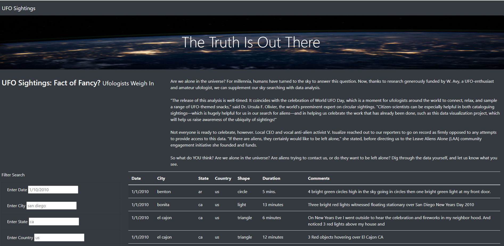
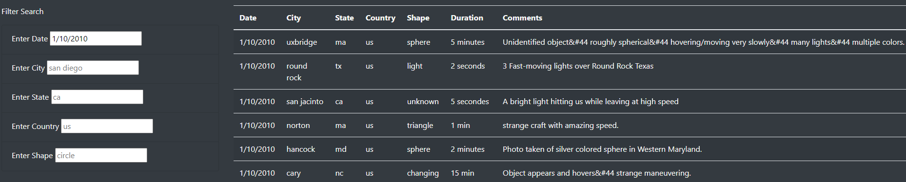
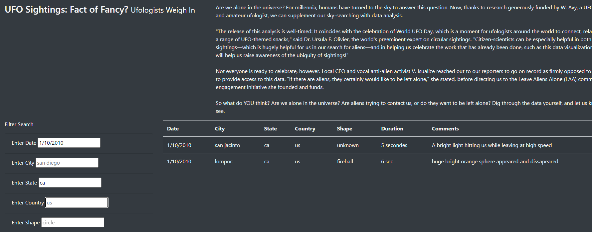

# UFOs
## Overview of the Project
A web site about UFO sightings was created using HTML and made aesthetically pleasing by adding CSS and Bootstrap stylizing. In order to organize all of the UFO sighting data, a table was built using a JavaScript array. Filters were added to make this table fully dynamic, meaning it will react to user input.  Ultimately, a web site was built that introduces the topic of UFOs and allows the user to search through a data table of UFO sightings using date, city, state, country or shape as search criteria.

## Results
The UFO web site can be used to sort data in a number of ways.  When the page initially loads all of the data entries can be viewed in the table, as shown in the screen shot below.  The table breaks down the UFO sighting information by date, city, state, country, shape and also adds comments about the event.

When the initial page loads, a lot of information is shown, which is most likely more than the user of the webpage will wish to see. By using the search filter on the bottom left part of the page, they can find specific sighting information that interests them.  For example, let's say someone wishes to find out how many UFO sightings occurred on January 10, 2010.  By entering this date into the date filter, as shown in the screenshot below, 11 events are immediately returned.  

Searches can be done using more than on criterion.  For example, we could add to the search done previously be requiring all of the sightings to have occurred in the state of California.  In the screenshot below "ca" was entered into the state filter and two results were instantly returned.  This enables users to gather as much or as little data for their query about UFOs. 

## Summary
A well-organized, good-looking web page was created that enables users to filter through data with five available filters.  However, one drawback of the web site is that 
it does not allow users to filter the "duration" or "comments" section of the data table.  It would be helpful to know whether a sighting lasted seconds versus minutes.  Short duration sightings are less likely to be as credible as long duration sightings.  Hence, a user may wish to be able to filter the information by "duration".  Some of the best details of the UFO sighting are found in the "comments" section.  Being able to access and group the details found in this column of the table, such as for words such as "hovering" or "fast" could be very useful.  
 
To improve this web site, it is recommended that two actions be performed.  First, the duration data should be converted to a standard time unit, such as minutes.  This value can then be easily searchable and a "Enter minimum duration" filter added to the web site to return durations of a minimum value.  Second, code that searches for words or phrases in the "comments" section of the JavaScript data array should be created.  Then a "Enter word(s) found in comments" filter should be added to the web page, where it would take in a string value and parse the "comments" array of the data table for this information.    
